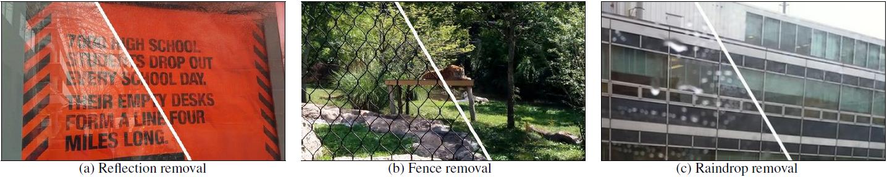

# [CVPR 2020] Learning to See Through Obstructions



We present a learning-based approach for removing unwanted obstructions, such as window reflections, fence occlusions or raindrops, from a short sequence of images captured by a moving camera. Our method leverages the motion differences between the background and the obstructing elements to recover both layers. Specifically, we alternate between estimating dense optical flow fields of the two layers and reconstructing each layer from the flowwarped images via a deep convolutional neural network. The learning-based layer reconstruction allows us to accommodate potential errors in the flow estimation and brittle assumptions such as brightness consistency. We show that training on synthetically generated data transfers well to real images. Our results on numerous challenging scenarios of reflection and fence removal demonstrate the effectiveness of the proposed method.

[[Project]](https://www.cmlab.csie.ntu.edu.tw/~yulunliu/ObstructionRemoval)

Paper

<a href="http://www.cmlab.csie.ntu.edu.tw/~yulunliu/ObstructionRemoval_/.pdf" rel="Paper"></a>

## Overview
This is the author's reference implementation of the multi-image reflection removal using TensorFlow described in:
"Learning to See Through Obstructions"
[Yu-Lun Liu](http://www.cmlab.csie.ntu.edu.tw/~yulunliu/), [Wei-Sheng Lai](https://www.wslai.net/), [Ming-Hsuan Yang](https://faculty.ucmerced.edu/mhyang/), [Yung-Yu Chuang](https://www.csie.ntu.edu.tw/~cyy/), [Jia-Bin Huang](https://filebox.ece.vt.edu/~jbhuang/) (National Taiwan University & Google & Virginia Tech & University of California at Merced & MediaTek Inc.)
in CVPR 2020.
Should you be making use of our work, please cite our paper [1]. 

Further information please contact [Yu-Lun Liu](http://www.cmlab.csie.ntu.edu.tw/~yulunliu/).

## Requirements setup
* [TensorFlow](https://www.tensorflow.org/)

* [Pre-trained PWC-Net](https://github.com/philferriere/tfoptflow)
    * Please overwrite tfoptflow/model_pwcnet.py using the one in this repository.

* To download the pre-trained models:

    * [ckpt](https://drive.google.com/open?id=1OUjr1Cj-nHOUEONoqIMnQIL9qTElpE6r)

## Data Preparation
* [Deep Voxel Flow (DVF)](https://github.com/liuziwei7/voxel-flow)

## Usage
* Run your own sequence (with online optimization):
``` bash
CUDA_VISIBLEDEVICES=0 python3 run_reflection.py
```

* Run your own sequence (fence removal):
``` bash
CUDA_VISIBLEDEVICES=0 python3 test_fence.py
```

## Citation
```
[1]  @inproceedings{Liu-Learning-CVPR-2020,
         author    = {Liu, Yu-Lun and Lai, Wei-Sheng and Yang, Ming-Hsuan and Chuang, Yung-Yu and Huang, Jia-Bin}, 
         title     = {Learning to See Through Obstructions}, 
         booktitle = {Conference on Computer Vision and Pattern Recognition},
         year      = {2020}
}
```
